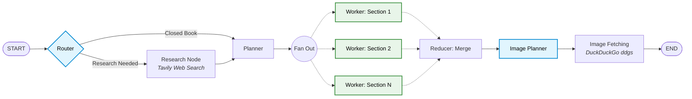

# Blog Bot

A multi-agent blog writing system built with LangGraph. Takes a topic string and produces a research-backed Markdown blog with embedded images.

## Architecture



- **Router** classifies topic as `closed_book` / `hybrid` / `open_book`.
- **Research** (conditional) uses Tavily to build an evidence pack.
- **Planner** emits a structured `Plan` of 5-9 `Task` objects.
- **Workers** write one section each in parallel (LangGraph `Send` API).
- **Reducer** merges sections, plans image placements, and sources specific web images via DuckDuckGo.

## Features

- **Multi-Agent Orchestration:** Dynamically routes between open/closed book strategies.
- **Parallel Processing:** Generates up to 9 sections entirely in parallel for blazing fast response times.
- **Dynamic Image Scraping:** Intelligently fetches real web images mapped to the blog content using `ddgs`.
- **History Management:** Built-in Streamlit capabilities to load past articles and securely delete old blogs (and their associated local image files) directly from the UI.

## Stack

- LangGraph + LangChain
- Groq (`llama-3.3-70b-versatile`) for all LLM calls
- Tavily for web research
- DuckDuckGo Search (`ddgs`) for image sourcing
- Streamlit frontend
- Pydantic v2 for state + structured output

## Setup

```bash
pip install -r requirements.txt
cp .env.example .env       # fill in GROQ_API_KEY, TAVILY_API_KEY
```

## Run

```bash
streamlit run app.py
```

Or from Python:

```python
from blog_agent.graph import run
state = run("Self-Attention in Transformers")
print(state["final_blog_path"])
```

## Tests

```bash
pytest -v
```
